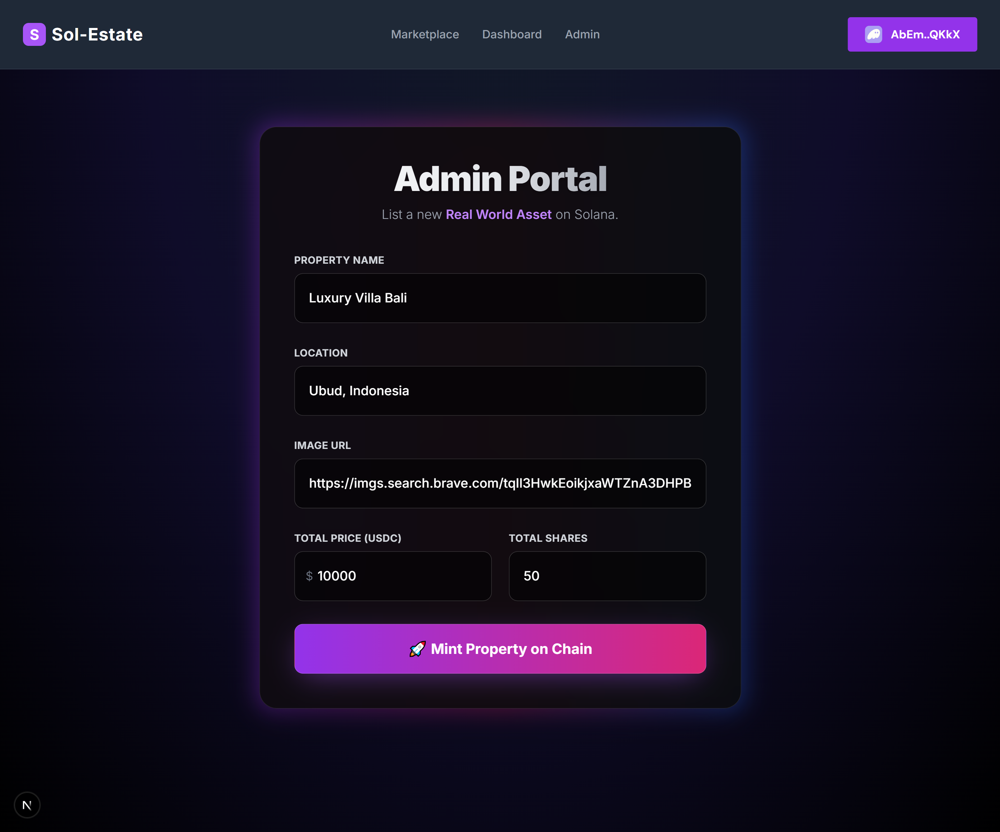
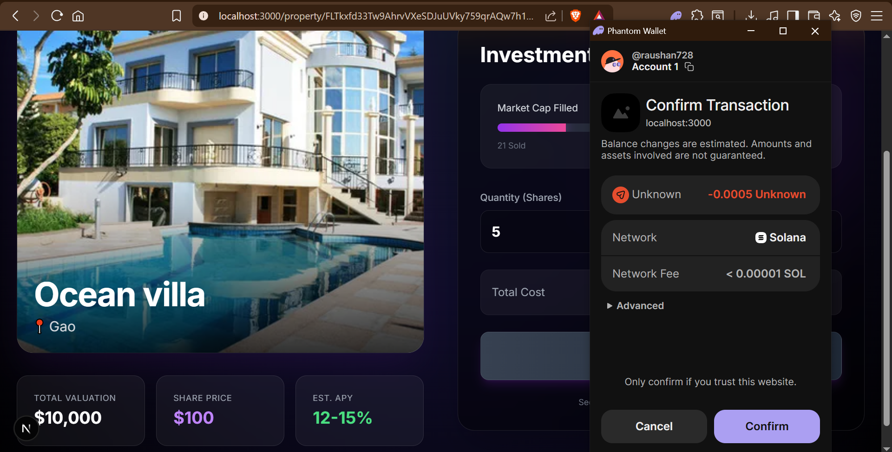
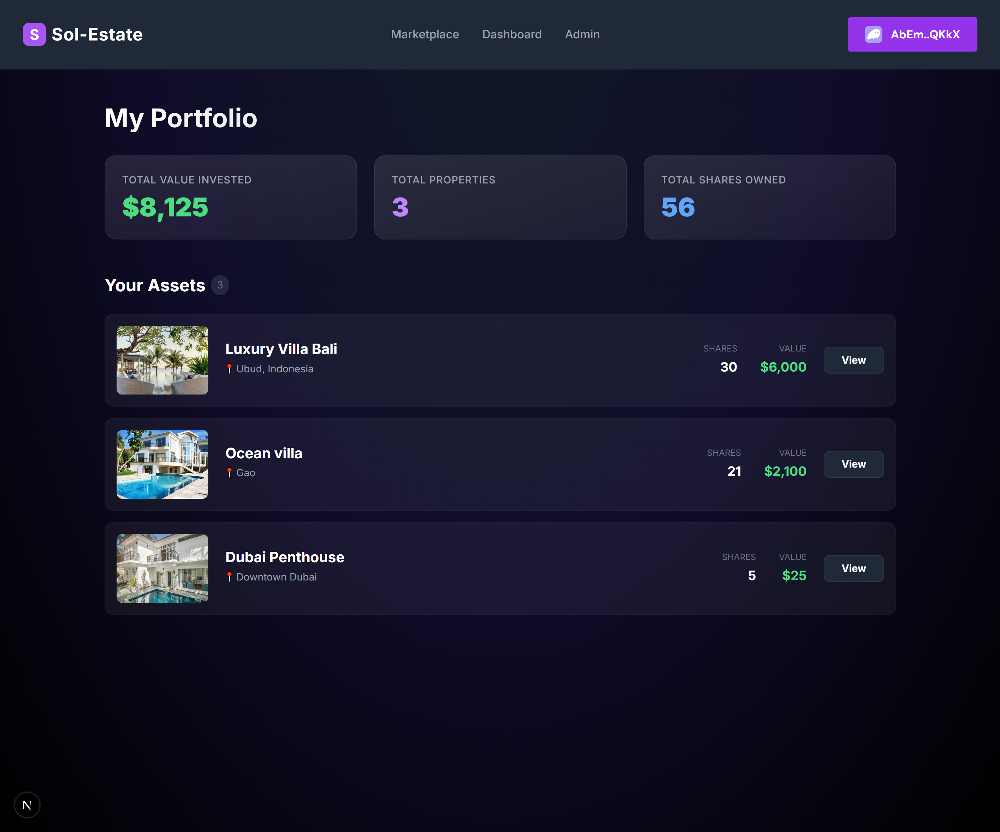

# Sol-Estate Platform

**Sol-Estate** is a decentralized Real World Asset (RWA) platform built on Solana using the Anchor Framework and Next.js. It allows users to invest in fractionalized real estate properties using USDC. The platform features an Admin Portal for listing properties, a Marketplace for viewing assets, and a User Dashboard for tracking portfolio performance. It utilizes a custom SPL Token (Fake USDC) for transactions to simulate real-world scenarios in a test environment.

---

## Table of Contents

- [Sol-Estate Platform](#sol-estate-platform)
  - [Introduction](#introduction)
  - [Key Features](#key-features)
- [System Architecture](#system-architecture)
  - [Account Structure & Relationships](#account-structure--relationships)
- [Prerequisites](#prerequisites)
  - [1. Operating System](#51-operating-system)
  - [2. Install Rust](#52-install-rust)
  - [3. Install Solana CLI](#53-install-solana-cli)
  - [4. Install Node.js & Yarn](#54-install-nodejs--yarn)
  - [5. Install Anchor Framework](#55-install-anchor-framework)
- [Installation Guide](#installation-guide)
  - [Step 1: Clone the Repository](#step-1-clone-the-repository)
  - [Step 2: Project Structure Overview](#step-2-project-structure-overview)
  - [Step 3: Install Backend Dependencies](#step-3-install-backend-dependencies)
  - [Step 4: Install Frontend Dependencies](#step-4-install-frontend-dependencies)
  - [Step 5: Run the Development Server](#step-5-run-the-development-server)
- [Configuration Guide](#configuration-guide)
  - [1. Get Your Program ID](#71-get-your-program-id)
  - [2. Update the Smart Contract (lib.rs)](#72-update-the-smart-contract-lib-rs)
  - [3. Update Anchor.toml](#73-update-anchortoml)
  - [4. Re-build the Program](#74-re-build-the-program)
  - [5. Deploy the Program](#75-deploy-the-program)
  - [6. Update Frontend Constants](#76-update-frontend-constants)
- [Wallet & Token Setup](#wallet--token-setup)
  - [1. Creating a File System Wallet](#81-creating-a-file-system-wallet)
  - [2. Airdropping SOL](#82-airdropping-sol)
  - [3. Minting Fake USDC](#83-minting-fake-usdc)
- [Visual Walkthrough & Usage](#visual-walkthrough--usage)
  - [Phase 1: Admin Listing](#phase-1-admin-listing)
  - [Phase 2: Successful Listing](#phase-2-successful-listing)
  - [Phase 3: Marketplace View](#phase-3-marketplace-view)
  - [Phase 4: Investment Terminal](#phase-4-investment-terminal)
  - [Phase 5: Transaction & Payment](#phase-5-transaction--payment)
  - [Phase 6: Portfolio Dashboard](#phase-6-portfolio-dashboard)
- [Testing](#testing)
- [Troubleshooting](#troubleshooting)
- [Contributing](#contributing)
- [Connect with Me](#connect-with-me)
- [License](#license)

---

## Introduction

Sol-Estate bridges the gap between traditional real estate and blockchain technology. By tokenizing properties on the Solana blockchain, we enable fractional ownership, increased liquidity, and transparent transaction history. This project demonstrates a full-stack Web3 application leveraging the high performance of Solana and the safety of the Anchor framework.

> [!NOTE]
> This project is currently deployed on the Solana **Devnet**. All transactions use a custom spl-token (Fake USDC) and do not involve real funds.

---

## Key Features

- **Admin Portal**: Secure interface for property owners/admins to list new real estate assets, specifying price, supply, and metadata.
- **Marketplace**: Public-facing gallery where users can browse listed properties and view details.
- **Fractional Investment**: Users can purchase fractional shares of properties using USDC.
- **User Dashboard**: Dedicated portfolio view for users to track their investments and asset performance.
- **Custom SPL Token Integration**: Fully functional implementation of SPL Token transactions (Fake USDC) with a dedicated faucet script.

---

## System Architecture

The platform architecture follows a standard dApp pattern on Solana:

1.  **Smart Contract (Program)**: Written in Rust using the Anchor Framework. It handles the logic for:
    -   Initializing property accounts.
    -   Managing the vault for holding USDC payments.
    -   Recording user investments (UserInvestment accounts).
2.  **Frontend**: A Next.js 14 application using TypeScript and Tailwind CSS.
3.  **Blockchain Interaction**: The frontend communicates with the Solana cluster via `@solana/web3.js` and `@coral-xyz/anchor`.

---

## Account Structure & Relationships

We utilize Program Derived Addresses (PDAs) to securely manage state and relationships between users and properties.

-   **Property Account (`Property`)**: Stores details about a specific real estate listing (price, location, total tokens, etc.).
    -   *Seeds*: `[b"property", owner_pubkey, property_id]`
-   **Vault Account (`Vault`)**: An associated token account (PDA) owned by the program to hold the USDC collected from sales.
    -   *Seeds*: `[b"vault", property_key]`
-   **User Investment Account (`UserInvestment`)**: Tracks how many shares of a specific property a user owns.
    -   *Seeds*: `[b"user-investment", property_key, user_pubkey]`

> [!NOTE]
> Using PDAs ensures deterministic addresses that cannot be manipulated by users, enforcing strict access control and data integrity.

---

## Prerequisites

Before starting, ensure your development environment is set up with the following tools.

### 5.1. Operating System
-   Linux (Ubuntu/Debian recommended) OR macOS.
-   Windows users are strictly advised to use **WSL2** (Windows Subsystem for Linux).

> [!TIP]
> **Linux Users:** Ensure you have the necessary dependencies installed before proceeding:
> ```bash
> sudo apt-get update && sudo apt-get upgrade && sudo apt-get install -y pkg-config build-essential libudev-dev libssl-dev
> ```

### 5.2. Install Rust
```bash
curl --proto '=https' --tlsv1.2 -sSf https://sh.rustup.rs | sh
rustc --version
```

### 5.3. Install Solana CLI
```bash
sh -c "$(curl -sSfL https://release.solana.com/v1.18.0/install)"
solana --version
```

### 5.4. Install Node.js & Yarn
```bash
# Install Node.js (LTS version recommended)
node -v
# Enable Corepack (includes Yarn)
corepack enable
yarn -v
```

### 5.5. Install Anchor Framework
```bash
cargo install --git https://github.com/coral-xyz/anchor avm --locked --force
avm install latest
avm use latest
anchor --version
```

---

## Installation Guide

Follow these steps to set up the project locally.

### Step 1: Clone the Repository
```bash
git clone https://github.com/raushan728/sol-estate-platform.git
cd sol-estate-platform
```

### Step 2: Project Structure Overview
-   `programs/`: Smart contract code (Rust/Anchor).
-   `app/`: Frontend application (Next.js).
-   `tests/`: Integration tests.
-   `Anchor.toml`: Configuration file for the workspace.

### Step 3: Install Backend Dependencies
```bash
# From the root directory
yarn install
```

### Step 4: Install Frontend Dependencies
```bash
cd app
yarn install
cd ..
```

### Step 5: Run the Development Server
Start the Next.js frontend to interact with the program.
```bash
cd app
yarn dev
```
*The application will be available at `http://localhost:3000`.*

---

## Configuration Guide

Proper configuration is essential for the program to interact correctly with the frontend.

### 7.1. Get Your Program ID
First, ensure you have a keypair. If not, generate one (see Section 8). Then run:

```bash
anchor keys sync
```
This command generates a new Program ID if one is missing or mismatches.

### 7.2. Update the Smart Contract (lib.rs)
If `anchor keys sync` did not update it automatically, find your Program ID in `Anchor.toml` and manually update `programs/sol-estate/src/lib.rs`:

```rust
declare_id!("YOUR_NEW_PROGRAM_ID");
```

### 7.3. Update Anchor.toml
Ensure the `[programs.localnet]` (or devnet) section in `Anchor.toml` matches your generic ID.

### 7.4. Re-build the Program
```bash
anchor build
```

> [!IMPORTANT]
> You must rebuild the program after changing the ID in `lib.rs` to ensure the binary matches the ID.

### 7.5. Deploy the Program
Once built, deploy the program to the configured network (Devnet/Localnet).
```bash
anchor deploy
```

### 7.6. Update Frontend Constants
Copy the *IDL* (Interface Description Language) file to your frontend structure if it's not automatically linked.
The `anchor build` command creates a `target/idl/sol_estate.json` file. Ensure your frontend consumes this IDL and the new Program ID.

---

## Wallet & Token Setup

This project requires a wallet funded with SOL (for gas) and our custom Fake USDC (for transactions).

### 8.1. Creating a File System Wallet
```bash
solana-keygen new --outfile ~/.config/solana/id.json
solana config set --keypair ~/.config/solana/id.json
```

### 8.2. Airdropping SOL
Switch to devnet (if not on localnet) and request SOL.
```bash
solana config set --url devnet
solana airdrop 2
```

### 8.3. Minting Fake USDC
We have provided a script to mint Fake USDC tokens to your wallet for testing purposes.

> [!TIP]
> Make sure you are in the project root or the `app` directory where the script is accessible. The command below assumes you are running from the `app` directory context or adjusting the path accordingly.

**Step 1: Edit the Script**
Open `app/scripts/mint-usdc.js` in your code editor.
Find **Line 11** and replace the `USER_WALLET_ADDRESS` with your own Solana Wallet Public Key.

```javascript
// Before
const USER_WALLET_ADDRESS = "AbEmcNkU9c1BeeXqjCipx9CQdFD1K987gWu6usdKQKkX";

// After (Replace with YOUR PublicKey)
const USER_WALLET_ADDRESS = "YOUR_WALLET_PUBLIC_KEY_HERE";
```

**Step 2: Navigate to the app directory**
```bash
cd app
```

**Step 3: Run the mint script**
```bash
node scripts/mint-usdc.js
```
*Follow the on-screen prompts to receive Fake USDC.*

> [!IMPORTANT]
> The script will output a **New USDC Mint Address**. Copy this address! You will need it to configure the "USDC Mint Address" when listing properties in the **Admin Portal**.

> [!NOTE]
> You can verify your balance using: `spl-token accounts` or by connecting your Phantom wallet to Devnet.

---

## Visual Walkthrough & Usage

Below is a step-by-step visual guide to using the platform.

### Phase 1: Admin Listing
The Admin Panel allows property owners to create new listings.


### Phase 2: Successful Listing
Confirmation screen after successfully listing a real world asset.


### Phase 3: Marketplace View
Users browse available properties on the main marketplace feed.


### Phase 4: Investment Terminal
Clicking on a property reveals detailed information and the investment interface.


### Phase 5: Transaction & Payment
Users confirm the transaction through their wallet provider (e.g., Phantom).


### Phase 6: Portfolio Dashboard
After investing, users can track their holdings in the dashboard.


---

## Testing

To run the integration tests included in the repository:

```bash
anchor test
```
*This command spins up a local validator, deploys the program, and runs the test suite defined in `tests/`.*

---

## Troubleshooting

> [!WARNING]
> **Common Error: "Account not found"**
> Ensure you have properly initialized the property before trying to invest in it. The Vault PDA must exist.

-   **Build Failures:** Ensure `cargo` and `anchor-cli` versions are compatible.
-   **Transaction Failures:** Check if you have enough SOL for gas and enough Fake USDC for the purchase.
-   **Phantom Wallet Issues:** Ensure your wallet is set to **Devnet**, not Mainnet.

---

## Contributing

Contributions are welcome!
1.  Fork the Project
2.  Create your Feature Branch (`git checkout -b feature/AmazingFeature`)
3.  Commit your Changes (`git commit -m 'Add some AmazingFeature'`)
4.  Push to the Branch (`git push origin feature/AmazingFeature`)
5.  Open a Pull Request

---

## Connect with Me

If you have any questions or want to collaborate, feel free to reach out!

-   **Email:** [raushankumarwork74@gmail.com](mailto:raushankumarwork74@gmail.com)
-   **LinkedIn:** [Raushan Kumar](https://www.linkedin.com/in/raushan-kumar-807916390/)
-   **Telegram:** [@raushan_singh_29](https://t.me/raushan_singh_29)

---

## License

Distributed under the MIT License. See [LICENSE](LICENSE) for more information.
