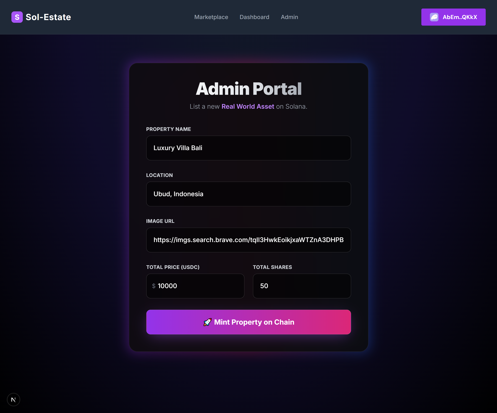
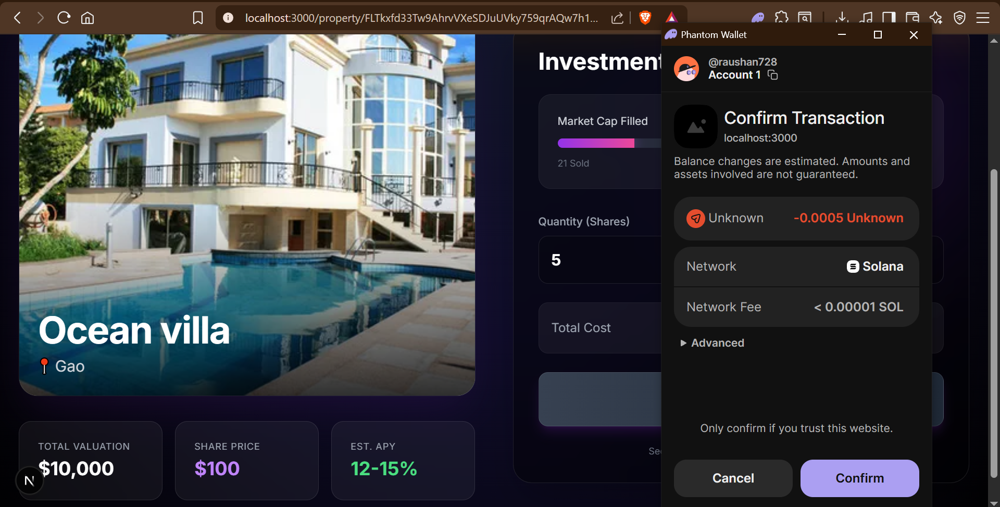
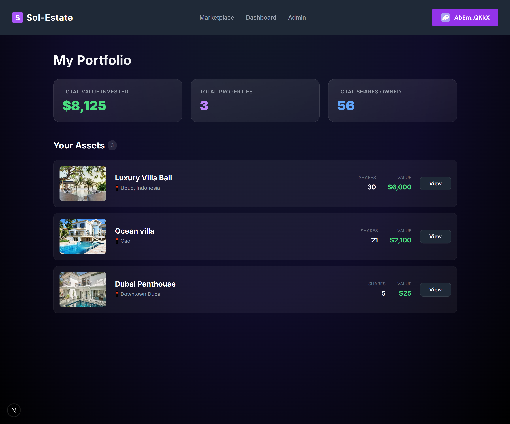

# Sol-Estate Platform - Frontend Client

This is the [Next.js] frontend application for Sol-Estate, a decentralized Real World Asset (RWA) investment platform built on Solana.

[Next.js]: https://nextjs.org/

## Prerequisites

- [Node.js] v20+
- npm or yarn

[Node.js]: https://nodejs.org/

## Getting Started

1. Install the dependencies:
   ```bash
   yarn install
   ```

2. Run the development server:
   ```bash
   yarn dev
   ```

3. Open [http://localhost:3000](http://localhost:3000) with your browser to explore the platform.

## Visual Walkthrough

### Phase 1: Admin Listing
The Admin Panel allows property owners to create new listings.


### Phase 2: Successful Listing
Confirmation screen after successfully listing a real world asset.


### Phase 3: Marketplace View
Users browse available properties on the main marketplace feed.


### Phase 4: Investment Terminal
Clicking on a property reveals detailed information and the investment interface.


### Phase 5: Transaction & Payment
Users confirm the transaction through their wallet provider.


### Phase 6: Portfolio Dashboard
After investing, users can track their holdings.


## Configuration

If you redeploy the Solana program to your own cluster, ensure you update the `PROGRAM_ID` in `src/app/utils/constants.ts` to match your new program ID, and provide the correct USDC Mint address when creating properties.
